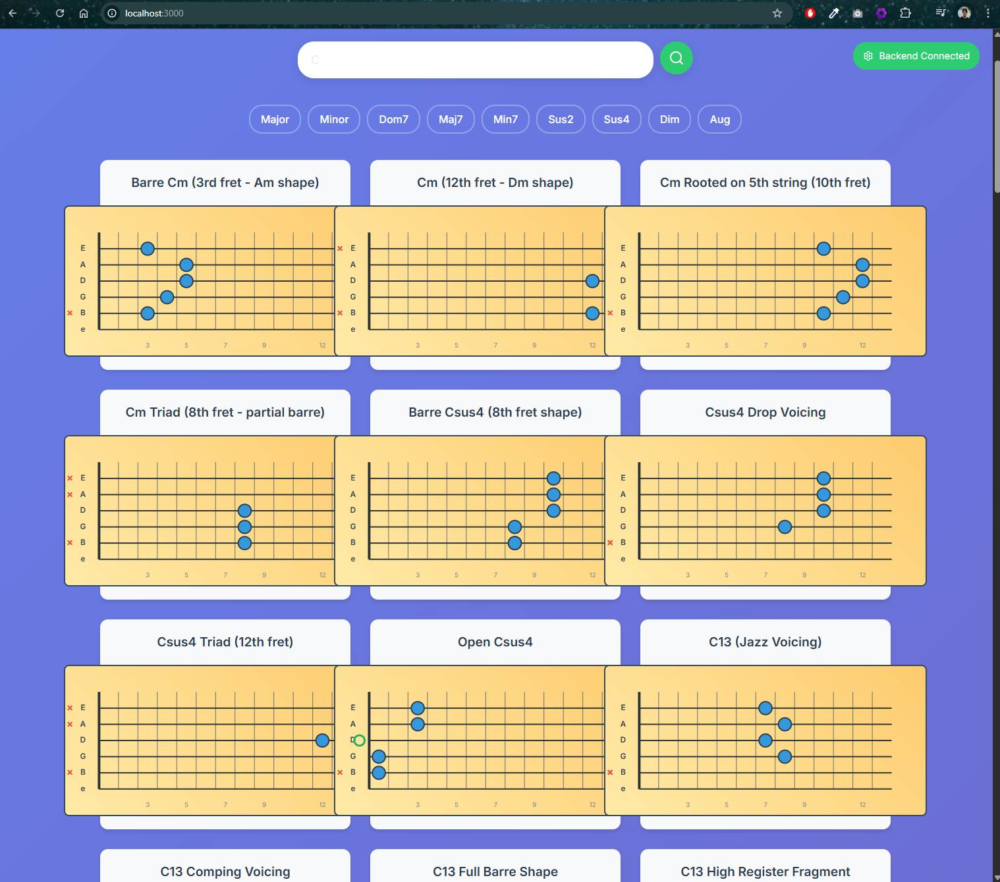

# 🎸 Harmony Hero - Guitar Chord Visualizer

A full-stack web application that helps guitarists discover and visualize chord shapes across the fretboard with an interactive, modern interface. Built with Next.js frontend and Scala 3 backend, featuring a comprehensive dictionary of 768+ unique chord shapes.

## 🎯 Demo



**Features Shown:**
- 🎨 Beautiful gradient interface with modern design
- 🔍 Real-time chord search by root note
- 🎼 Quality filters (Major, Minor, Dom7, Maj7, Min7, Sus2, Sus4, Dim, Aug)
- 🎸 Interactive SVG fretboard diagrams with accurate fingering positions
- 📱 Responsive grid layout for multiple chord variations
- 🟢 Live backend connection status indicator

**Live Example:** Search for "C" chords and filter by quality to see various fingering patterns including barre chords, open chords, and advanced voicings.

## 🏗️ Architecture

- **Frontend**: Next.js 14 with React 18+ and styled-components for interactive chord exploration
- **Backend**: Scala 3 with Netty HTTP server serving REST APIs
- **Database**: PostgreSQL (containerized for local development)
- **Infrastructure**: Docker Compose for containerized development
- **Styling**: Tailwind CSS + styled-components for modern UI components

## 📦 Project Structure

```
guitar-visualizer/
├── frontend-nextjs/        # Next.js 14 app with React 18+
│   ├── src/
│   │   ├── app/           # App router pages
│   │   ├── components/    # React components (Fretboard, etc.)
│   │   └── types/         # TypeScript definitions
│   ├── package.json
│   ├── next.config.js
│   ├── tailwind.config.js
│   └── Dockerfile
├── backend/                # Scala 3 + Netty
│   ├── src/
│   ├── build.sbt
│   └── Dockerfile
├── infra/                  # Database migrations
│   ├── init-postgres.sql
│   └── Dockerfile
├── shared/                 # Chord data JSON files
├── chords_fingering/       # Chord fingering data
├── docker-compose.yml
└── README.md
```

## 🚀 Quick Start

### Prerequisites
- Docker & Docker Compose
- Node.js 18+ (for frontend development)
- sbt (for backend development)

### Local Development

1. **Start all services:**
   ```bash
   docker-compose --profile local up
   ```

2. **Individual service commands:**
   ```bash
   # Start infrastructure (PostgreSQL)
   docker-compose --profile infra up
   
   # Start backend only
   docker-compose up backend
   
   # Start frontend only (for development)
   cd frontend-nextjs && npm run dev
   ```

3. **Access the application:**
   - Frontend: http://localhost:3000
   - Backend API: http://localhost:8080
   - Database: postgresql://localhost:5432/guitar_chords

## 🎯 API Endpoints

- `GET /health` - Health check endpoint
- `GET /chords/{root}` - Get all chord shapes for a given root note (e.g., C, F#, Bb)
- `GET /chords/{root}/{quality}` - Get specific chord variations (e.g., /chords/C/major)

### Supported Chord Qualities
- **Basic**: `major`, `minor`, `diminished`, `augmented`
- **Seventh**: `dominant7`, `major7`, `minor7`
- **Suspended**: `suspended2`, `suspended4`

### Example API Calls
```bash
# Get all C chords
curl http://localhost:8080/chords/C

# Get C major chord variations
curl http://localhost:8080/chords/C/major

# Get F# minor seventh chords  
curl http://localhost:8080/chords/F%23/minor7

# Health check
curl http://localhost:8080/health
```

## 🎼 Frontend Features

The Next.js frontend provides an intuitive interface for chord exploration:

### 🎨 UI Components
- **Interactive Fretboard**: SVG-based guitar fretboard with accurate string spacing and fret positioning
- **Chord Search**: Real-time search by root note with autocomplete
- **Quality Filters**: Single-selection chord quality filters (Major, Minor, Dom7, etc.)
- **Responsive Grid**: Adaptive layout showing multiple chord variations
- **Live Status**: Real-time backend connection indicator

### 🎸 Fretboard Visualization
- **String Mapping**: Accurate 6-string guitar layout (E-A-D-G-B-e)
- **Finger Positions**: Color-coded dots for finger placement
- **Root Notes**: Highlighted root note positions
- **Open Strings**: Distinct markers for open string notes
- **Muted Strings**: Clear indication of muted/dampened strings

### 📱 Responsive Design
- **Mobile-First**: Optimized for touch devices and small screens
- **Desktop Enhanced**: Rich experience on larger displays
- **Accessibility**: Keyboard navigation and screen reader support

## 🔧 Development

### Frontend (Next.js 14 + React 18)
```bash
cd frontend-nextjs
npm install
npm run dev          # Development server
npm run build        # Production build
npm run start        # Production server
```

**Key Dependencies:**
- Next.js 14 with App Router
- React 18 with hooks
- styled-components for CSS-in-JS
- Tailwind CSS for utility classes
- Lucide React for icons
- Axios for API calls

### Backend (Scala 3 + Netty)
```bash
cd backend
sbt compile
sbt run              # Start development server
sbt test             # Run tests
```

**Key Dependencies:**
- Scala 3 with modern syntax
- Netty for HTTP server
- PostgreSQL JDBC driver
- HikariCP connection pooling
- Flyway for database migrations

## 🐳 Docker Commands

```bash
# Build all containers
docker-compose build

# Start full stack (backend + frontend + database)
docker-compose --profile full up

# Start local development (backend + database, frontend runs locally)
docker-compose --profile local up

# Start only infrastructure (database)
docker-compose --profile infra up

# View logs for specific service
docker-compose logs -f backend
docker-compose logs -f frontend
docker-compose logs -f postgres

# Stop all services
docker-compose down

# Clean up containers and volumes
docker-compose down -v
```

## 📊 Database Schema

The PostgreSQL database stores chord data with the following structure:

### Tables
- **`chords`**: Main chord definitions with root note and quality
- **`chord_variations`**: Multiple fingering patterns for each chord
- **`chord_qualities`**: Available chord types (major, minor, etc.)

### Sample Data Structure
```sql
-- Chord record
{
  "key": "C",
  "quality": "major", 
  "representation": "C",
  "variations": [
    {
      "name": "C Major (Open)",
      "diagram": "e0, b1, g0, d2, a3, Ex",
      "difficultyLevel": 1
    },
    {
      "name": "C Major (Barre - 8th fret)",
      "diagram": "e8, b8, g9, d10, a10, E8",
      "difficultyLevel": 3
    }
  ]
}
```

### Diagram Format
The `diagram` field uses a compact string notation:
- `e0` = High E string, open (0th fret)
- `b1` = B string, 1st fret
- `g0` = G string, open
- `d2` = D string, 2nd fret  
- `a3` = A string, 3rd fret
- `Ex` = Low E string, muted

## 🧪 Testing

```bash
# Backend tests
cd backend && sbt test

# Frontend type checking
cd frontend-nextjs && npm run build

# Manual API testing
curl http://localhost:8080/health
curl http://localhost:8080/chords/C
curl http://localhost:8080/chords/C/major
```

## 🚀 Deployment

### Production Build
```bash
# Build optimized containers
docker-compose build

# Deploy with production profile
docker-compose --profile full up -d
```

### Environment Variables
- `DATABASE_URL`: PostgreSQL connection string
- `NODE_ENV`: Environment mode (development/production)
- `NEXT_PUBLIC_API_BASE_URL`: Backend API URL for frontend

## 📝 License

MIT License - see LICENSE file for details.

## 🤝 Contributing

1. Fork the repository
2. Create a feature branch (`git checkout -b feature/amazing-feature`)
3. Commit your changes (`git commit -m 'Add amazing feature'`)
4. Push to the branch (`git push origin feature/amazing-feature`)
5. Open a Pull Request

## 🎵 Acknowledgments

- Chord fingering data curated from various guitar education resources
- Built with modern web technologies for optimal performance
- Designed for guitarists of all skill levels
